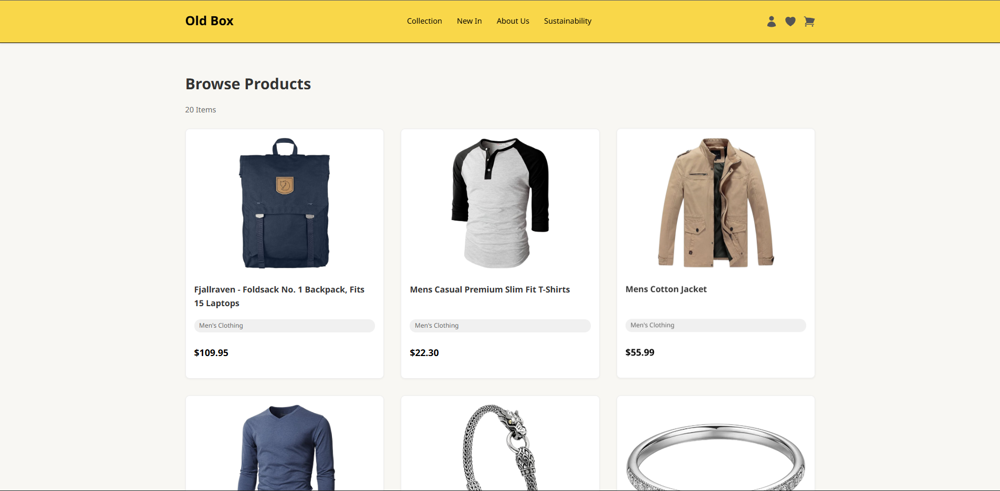

# Old Box 📦

นี่คือโปรเจกต์เว็บง่ายๆ สำหรับดูรายการสินค้า สร้างขึ้นมาสำหรับ YDP Mini-Project โดยใช้แค่ **HTML, CSS, และ JavaScript พื้นฐาน** เท่านั้น

เว็บนี้จะดึงข้อมูลสินค้ามาจาก API ข้างนอก (Fake Store API) แล้วเอามาแสดงผลบนหน้าเว็บ


---

## ✨ ทำอะไรได้บ้าง?

* **ดูสินค้า:** โหลดข้อมูลสินค้ามาจากอินเทอร์เน็ตแล้วโชว์เป็นการ์ดสวยๆ
* **ปรับตามหน้าจอ:** หน้าเว็บจะเปลี่ยน Layout ให้อ่านง่ายทั้งบนคอมและมือถือ

---

## 🛠️ ใช้เทคโนโลยีอะไรบ้าง?

* **HTML:** สร้างโครงสร้างหน้าเว็บ
* **CSS:** ตกแต่งหน้าเว็บให้สวยงาม (ใช้ Flexbox/Grid จัด Layout)
* **JavaScript:**
    * ดึงข้อมูลจาก API ด้วย `fetch()`
    * สร้างการ์ดสินค้าขึ้นมาแสดงผลบนหน้าเว็บ (DOM Manipulation)
* **API:** [Fake Store API](https://fakestoreapi.com/) (เว็บที่ให้ข้อมูลสินค้ามาฟรีๆ)

---

## 🚀 วิธีเปิดดูเว็บนี้บนเครื่องตัวเอง

1.  **โหลดโค้ด:** โคลน (Clone) Repository นี้ หรือดาวน์โหลดไฟล์โค้ดทั้งหมดมาไว้บนเครื่อง
    ```sh
    git clone [https://github.com/MonKla/Old-Box-Real-.git](https://github.com/MonKla/Old-Box-Real-.git) 
    ```
2.  **เปิดโฟลเดอร์:** เข้าไปในโฟลเดอร์โปรเจกต์ที่โหลดมา
    ```sh
    cd Old-Box-Real- 
    ```
    *(ถ้าชื่อโฟลเดอร์ไม่ใช่ `Old-Box-Real-` ให้เปลี่ยนด้วย)*
3.  **เปิดไฟล์:** ดับเบิลคลิกที่ไฟล์ `index.html` เพื่อเปิดในเว็บเบราว์เซอร์

    *หรือถ้าใช้ VS Code ที่มี Extension "Live Server":*
    * คลิกขวาที่ไฟล์ `index.html` ใน VS Code
    * เลือก "Open with Live Server"